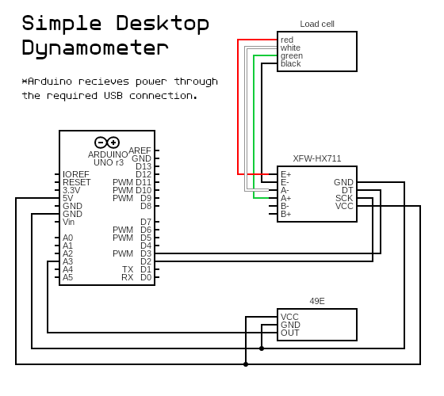

# OP-1 3D printed air pressure engine project

This repository exists to provide source files for my video on creating a 3d printed air pressure based engine as well as the Arduino based dynamometer I used to measure the engine's power output. Link to the video here: https://youtu.be/o1WNxSCf7WM

The project ended in a mixed success, with the engine showing it's capable of working. However before testing was allowed to conclude, the engine encountered a problem which crippled the engine. 

This project is licensed under the [MIT license](LICENSE). 

## The OP-1 3D printed air pressure engine

OP-1 is a mostly 3D-printable opposed-piston engine that uses pressurized gas as its energy source. The engine was designed in 3D modelling and animation software Blender. As such, the model file for the engine can be found in the Blender folder of the repo as ["AtMoT OP-1 air pressure engine.blend"](Blender/AtMoT%20OP-1%20air%20pressure%20engine.blend). In addition, the Blender folder also includes a ["AtMoT OP-1 air pressure engine animation.blend"](Blender/AtMoT%20OP-1%20air%20pressure%20engine%20animation.blend) file, which has the necessary rigging and constraints to be able to animate the working sequence of the engine. 

The engine works by self-timing the opening and closing of two small airtight ball valves in such a way that the expansion of pressurized gas (usually just pressurized air) is exploited to drive two opposing pistons in a single cylinder. Each of the pistons have a crankshaft, and each of the crankshafts has a power gear. The power gears are coupled together through the engine output gear. 

### **Some stats:**
**Dimensions (with flywheel):** 73x69x41mm\
**Weight (with flywheel):** 96,6g\
**Displacement:** 1,8cm³\
**Power at 40psi:** >=0.4W*

*Unfortunately the engine ceased to work properly before testing was able to conclude.

## Dynamometer

In order to measure the engine's performance I had to build a dynamometer. I followed a semi-guide from Youtube: https://www.youtube.com/watch?v=NIpspXaPVcs

The Youtube guide calls for using an Arduino Uno or equivalent, a sufficient load cell, a DX711 load cell DAC and amplifier module as well as a photointerrupter. Unfortunately I did not have a photointerrupter at hand, so I decided to use a 49E linear hall-effect sensor in order to measure the RPM, by sensing opposing polarity poles from two neodymium magnets attached to the flywheel. However, that meant that I could no longer use the code for the Arduino from the Youtube guide. So I decided to write my own dynamometer code. 

The dynamometer code for Arduino nano or equivalent is situated in the src folder of the repo as "load_cell.ino". The code employs the use of a HX711 module library to drive the load cell. The HX711 library is situated in the lib folder of the repo. 

\
Schematic on how to wire up the simple desktop dynamometer.

Please note that the dynamo setup and code displayed here requires the the engine/motor being tested to have a rotation rate of 600RPM or more. The highest RPM count is not known at this moment. 

The code for the RPM counter part of the dynamo was made in a hurry and could be improved greatly by rewriting it. It is more than likely that I will improve the code sometime in the future. 